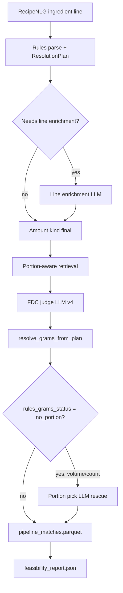

# Capstone — Food & Recipe Data Pipeline

Berkeley Capstone project for loading public food-composition, recipe, and unit-conversion datasets into **Supabase Postgres**. Raw files live under `Data/` (gitignored); loaders create four logical schemas on the database.

## Repository layout

```
Capstone/
├── Data/                          # Raw datasets (not committed; see .gitignore)
│   ├── All_Food_Data_April_2026/  # USDA FoodData Central CSV export
│   ├── recipes/                   # open_recipes.json, RecipeNLG.csv
│   ├── conversions/               # food_density.csv (generated from PDF)
│   └── food_density.pdf           # FAO/INFOODS Density Database v2.0
├── scripts/                       # Python utilities and loaders
│   ├── db.py                      # Shared Supabase connection from .env
│   ├── infer_schema.py            # Introspect usda schema + infer joins
│   ├── load_recipes.py            # recipe schema (Open Recipes + RecipeNLG)
│   ├── load_recipe_embeddings.py  # MiniLM vectors → recipe.recipe_nlg_embedding
│   ├── dedupe_recipe_nlg.py       # Kadin hybrid dedup (DELETE duplicates)
│   └── load_food_density.py       # PDF → CSV → conversions schema
├── sql/                           # DDL and psql-based USDA bulk load
│   ├── 00_create_schema.sql …     # usda tables + COPY scripts
│   ├── 10_create_recipe_schema.sql
│   ├── 20_create_conversions_schema.sql
│   └── load_*.sh                  # Shell wrappers for loaders
├── pyproject.toml                 # Project metadata and dependencies (uv)
├── uv.lock                        # Locked dependency versions
├── requirements.txt               # Pip-compatible pin list (optional)
├── .env.example                   # Supabase connection template
└── README.md
```

## Data overview

### USDA FoodData Central (`Data/All_Food_Data_April_2026/`)

April 2026 **full download** (CSV). ~25 files, ~2.1M foods in `food.csv`, ~27M rows in `food_nutrient.csv`. Loaded into the **`usda`** schema.

| Area | Main tables | Role |
|------|-------------|------|
| Core | `food`, `nutrient`, `food_category`, `measure_unit` | Every food item (`fdc_id`) and reference nutrients/units |
| Branded / legacy / FNDDS | `branded_food`, `foundation_food`, `sr_legacy_food`, `survey_fndds_food`, … | Type-specific metadata keyed by `fdc_id` |
| Composition | `food_nutrient`, `food_portion`, `food_component` | Nutrients per 100g, portions, refuse/components |
| Lab / samples | `lab_method*`, `sub_sample_*`, `market_acquisition` | Analytical methods and sample lineage |

Hub model: **`food.fdc_id`** links to extension tables (`branded_food`, `food_nutrient`, etc.). Run `uv run python scripts/infer_schema.py` for a full join map and `scripts/usda_schema_inferred.json`.

### Recipes (`Data/recipes/`)

| File | Rows (approx.) | DB table |
|------|----------------|----------|
| `open_recipes.json` | ~173k (JSON lines, schema.org-style) | `recipe.open_recipe` |
| `RecipeNLG.csv` | ~2.2M | `recipe.recipe_nlg` |

`recipe_nlg` stores `ingredients`, `directions`, and `ner` as JSON text; `open_recipe` keeps ingredients as a single text block plus URL, times, source, etc.

### Conversions (`Data/food_density.pdf` → `Data/conversions/food_density.csv`)

FAO/INFOODS **Density Database v2.0** — volume ↔ mass factors (g/ml, specific gravity). **638 foods** in **`conversions.food_density`**.

---

## Database schemas (Supabase)

| Schema | Purpose | How to load |
|--------|---------|-------------|
| `usda` | FoodData Central | `./sql/load_all.sh` (needs `psql`) |
| `recipe` | Open Recipes + RecipeNLG | `uv run python scripts/load_recipes.py` |
| `conversions` | Food density factors | `uv run python scripts/load_food_density.py` |

Connection settings are read from **`.env`** (copy from `.env.example`). Python loaders use the **session pooler** on port **5432** by default; USDA `\copy` scripts do the same.

```
postgresql://<PG_POOL_USER>:<password>@<PG_POOL_HOST>:5432/postgres?sslmode=require
```

> **Storage:** Full USDA + RecipeNLG is multi‑GB. Ensure your Supabase plan has enough disk before loading everything. RecipeNLG supports resume: `uv run python scripts/load_recipes.py --nlg-only`.

---

## Setup with [uv](https://docs.astral.sh/uv/)

[uv](https://docs.astral.sh/uv/) manages the virtualenv and dependencies via `pyproject.toml` and `uv.lock`.

### Install uv

```bash
curl -LsSf https://astral.sh/uv/install.sh | sh
# or: brew install uv
```

### First-time project setup

```bash
cd Capstone
cp .env.example .env   # fill in PG_PASSWORD, PG_POOL_USER, PG_POOL_HOST

# MVP runtime only (~96 packages; matches Docker image)
uv sync

# Full local environment (notebooks, batch pipeline scripts, tests)
uv sync --extra notebook --extra pipeline --extra dev
```

### Run scripts inside the project environment

Prefix commands with `uv run` so the correct interpreter and packages are used:

```bash
uv run python scripts/infer_schema.py
uv run python scripts/load_recipes.py
uv run python scripts/load_food_density.py
```

You can also activate the venv directly:

```bash
source .venv/bin/activate
python scripts/infer_schema.py
```

### Add or upgrade packages

Add a new runtime dependency (updates `pyproject.toml` and `uv.lock`):

```bash
uv add requests
```

Add a dev-only dependency:

```bash
uv add --dev pytest ruff
```

Upgrade a package to the latest compatible version:

```bash
uv add --upgrade pandas
```

Remove a package:

```bash
uv remove pandas
```

After any `uv add` / `uv remove`, commit both `pyproject.toml` and `uv.lock`. Teammates run `uv sync` to match.

### Other useful uv commands

| Command | What it does |
|---------|----------------|
| `uv sync` | Install MVP runtime deps from lockfile into `.venv` |
| `uv sync --extra notebook --extra pipeline --extra dev` | Install notebooks, batch pipeline, and test deps |
| `uv lock` | Refresh `uv.lock` after hand-editing `pyproject.toml` |
| `uv pip install -r requirements.txt` | Install from `requirements.txt` if you use that file |
| `uv run <cmd>` | Run a command in the project environment |
| `uv python pin 3.11` | Pin local Python version (see `.python-version`) |

Current project dependencies: `numpy`, `pandas`, `pdfplumber`, `psycopg2-binary`.

---

## Loading data

### 1. USDA (SQL + psql)

Requires [PostgreSQL client](https://www.postgresql.org/download/) (`psql`). From repo root:

```bash
./sql/load_all.sh
```

Runs, in order: `00_create_schema.sql` → reference/food COPY scripts → `99_create_indexes.sql`. Expect a long run for `food_nutrient.csv`.

### 2. Recipes (Python)

```bash
uv run python scripts/load_recipes.py              # full load
uv run python scripts/load_recipes.py --extract-only   # not applicable (JSON/CSV only)
uv run python scripts/load_recipes.py --nlg-only       # resume RecipeNLG after partial load
```

### 3. Recipe embeddings (Python)

Streams local `Data/recipes/RecipeNLG.csv` in chunks (does not load 2.2M rows from Supabase). Uploads only ids present in `recipe.recipe_nlg`. Enable **pgvector** first.

```bash
uv run python scripts/load_recipe_embeddings.py --limit 5000   # smoke test
uv run python scripts/load_recipe_embeddings.py                  # full CSV → DB
```

### 4. Recipe deduplication (Python)

Kadin's hybrid pipeline from `exploration.ipynb`. **Dry-run first**, then delete:

```bash
uv run python scripts/dedupe_recipe_nlg.py --dry-run
uv run python scripts/dedupe_recipe_nlg.py --limit 10000 --dry-run
uv run python scripts/dedupe_recipe_nlg.py --execute
```

Phase 1 removes exact duplicates (same title + ingredients + directions). Phase 2 uses MiniLM/FAISS/hybrid scoring and keeps one recipe per cluster (most ingredients, then longest directions). Manifests: `Data/dedup/`. Use `--use-db-embeddings` if vectors are already loaded.

### 5. Food density / conversions (Python)

```bash
uv run python scripts/load_food_density.py           # PDF → CSV → DB
uv run python scripts/load_food_density.py --extract-only
uv run python scripts/load_food_density.py --load-only
```

CSV output: `Data/conversions/food_density.csv`.

### 6. Schema introspection

```bash
uv run python scripts/infer_schema.py
uv run python scripts/infer_schema.py --schema usda --out scripts/usda_schema_inferred.json
```

---

## Environment variables

| Variable | Description |
|----------|-------------|
| `PG_PASSWORD` | Database password |
| `PG_POOL_USER` | Pooler user, e.g. `postgres.<project-ref>` |
| `PG_POOL_HOST` | Pooler host |
| `PG_POOL_SESSION_PORT` | Session pooler (default `5432`) |
| `PG_POOL_TRANSACTION_PORT` | Transaction pooler (`6543`) |
| `PG_DATABASE` | Database name (default `postgres`) |
| `PG_SSL_MODE` | SSL mode (default `require`) |
| `PG_PSQL_USE_TRANSACTION_POOLER_PORT` | Set to `1` to use port 6543 in Python loaders |

---

## Obtaining raw data

Place files under `Data/` (not tracked in git):

1. **USDA:** [FoodData Central download](https://fdc.nal.usda.gov/download-datasets) → “Full download of all data types” (April 2026) → unzip into `Data/All_Food_Data_April_2026/`.
2. **Recipes:** [Open-Recipes Repo](https://github.com/jakevdp/open-recipe-data/tree/main) `open_recipes.json` and [RecipeNLG Dataset](https://recipenlg.cs.put.poznan.pl/) `RecipeNLG.csv` under `Data/recipes/`.
3. **Density:** [Density PDF](https://www.fao.org/4/ap815e/ap815e.pdf) `food_density.pdf` in `Data/` (or use the copy already there).

---

## Ingredient resolution pipeline (`fdc_id` + `gram_weight`)

Each RecipeNLG ingredient line is resolved to a USDA **`fdc_id`** (`llm_fdc_id` in artifacts) and a **`grams`** value (gram weight for that line’s quantity). The pipeline is orchestrated by `scripts/portion_pipeline_feasibility.py` and logged to MLflow experiment `portion_pipeline_feasibility`.

### End-to-end flow



| Phase | Script / module | Output |
|-------|-----------------|--------|
| 1. Parse + plan | `recipe_parse_rules.py`, `resolution_plan.py`, `line_enrichment_llm.py` | `amount_classification.parquet` |
| 2. Retrieval + judge | `portion_aware_match.py`, `ingredient_match_llm_portion.py` | `judge_matches_raw.parquet` |
| 3. Rules grams | `portion_gram.py` (`resolve_grams_from_plan`) | `rules_grams`, `rules_grams_status` |
| 4. Portion LLM rescue | `portion_resolve_llm.py` | Updates `grams` when rules returned `no_portion` |
| 5. Report | `portion_pipeline_feasibility.py`, `feasibility_mlflow.py` | `feasibility_report.json`, MLflow run |

**Gram resolution ladder** (`portion_gram.py`): tries embedded/explicit mass → volume portion → count portion (with container-mass and whole-item fallbacks) → terminal flags (`vague_amount`, `ambiguous_accepted`, `negligible_calories`) → `no_portion` if nothing worked. Judge-time resolution uses the LLM’s optional `matched_portion_id`.

### Running the feasibility pipeline

Requires local `Data/recipes/RecipeNLG.csv`, USDA data in Supabase, and `.env` configured.

```bash
# Full 1,000-recipe sample (seed 42)
uv run python scripts/portion_pipeline_feasibility.py --n-recipes 1000 --seed 42

# v4 retry: re-judge only former no_portion rows (writes to separate dir)
uv run python scripts/portion_pipeline_feasibility.py \
  --n-recipes 1000 --seed 42 --only-no-portion --force-payloads \
  --baseline-dir scratch/EDA/portion_feasibility_1000

# Golden regression tests (no API)
uv run python tests/test_portion_resolution_cases.py
```

Artifacts land under `scratch/EDA/portion_feasibility_1000_v4_no_portion/` (v4 run; baseline dir is read-only). Large caches (`payloads.pkl`, `recipe_cache/`, parquets) are gitignored — regenerate locally.

### Latest run results (v4, 1,000 recipes / seed 42)

Prompt version: `v4_portion_good_enough`. Merged output: **6,095** preserved v3 lines + **2,659** v4 re-judged `no_portion` lines = **8,754** ingredient lines.

#### Headline metrics

| Metric | Value | Meaning |
|--------|------:|---------|
| **`fdc_and_gram_rate_all`** | **71.1%** | Lines with both `llm_fdc_id` and `grams` |
| `fdc_match_rate_all` | 88.0% | Lines with any fdc match |
| `gram_resolve_rate_all` | 71.1% | Lines with non-null `grams` |
| `fdc_and_gram_rate_needs_portion` | 75.7% | Same, on 7,466 volume/count lines |
| `rules_gram_rate_needs_portion_given_fdc` | 80.9% | Rules resolve grams when fdc exists |
| `llm_portion_rescue_rate_needs_portion` | 4.9% | Second-pass portion LLM saved grams |
| `no_portion_rate` | 3.9% (345 lines) | Still unresolved after all passes |
| `judge_error_count` | 6 | Hard API failures |

**Improvement vs baseline v3:** 58.7% → **71.1%** fdc+grams (+12.4 pp). `no_portion` dropped from 2,659 → **345** globally after v4 judge + portion LLM rescue (324 rescues → `ok_count_portion_llm`).

#### By amount kind

| Kind | Lines | fdc + grams |
|------|------:|------------:|
| Volume | 4,909 | **81.2%** |
| Mass | 963 | **89.1%** |
| Count | 2,242 | **61.5%** |
| Unknown | 640 | 0.0% |

Count resolution is the main weakness; volume and mass are strong.

#### Remaining failures (`grams` null)

| `grams_status` | Lines | Notes |
|----------------|------:|-------|
| `missing_fdc` | 2,152 | Judge abstained or sentinel `999000001` (no gram path) |
| `no_portion` | 345 | Has fdc, all portion paths failed |
| `vague_amount` | 16 | “to taste”, no quantity |
| `unresolvable_serving_only` | 11 | USDA only has serving portions |
| `ambiguous_accepted` | 4 | Deliberately skipped |
| `bad_unit` | 4 | e.g. gallons |

`no_portion` is only one failure mode — lines can lack grams for other reasons and were **not** included in the v4 `--only-no-portion` retry.

#### Recipe-level (MVP)

| Bucket | Recipes | % of 1,000 |
|--------|--------:|-----------:|
| **All lines gram-resolved** | **106** | **10.6%** |
| All but 1 unresolved | 248 | 24.8% |
| ≤1 unresolved | 354 | 35.4% |
| Median unresolved lines / recipe | 2 | — |

**MVP candidate set:** 106 recipes where every ingredient line has `grams` (634 lines total). See recipe-level EDA below.

#### Sample provenance (RecipeNLG metadata)

| NLG `source` | Recipes |
|--------------|--------:|
| Gathered | 737 |
| Recipes1M | 263 |

Top link domains in the 1,000-recipe sample: `cookbooks.com` (379), `food.com` (266), `epicurious.com` (59), …

### EDA notebooks (start here)

Your partner should open these with Jupyter kernel cwd = `Capstone/` or `scratch/EDA/`:

| Notebook | Purpose |
|----------|---------|
| **[scratch/EDA/portion_feasibility_run_eda.ipynb](scratch/EDA/portion_feasibility_run_eda.ipynb)** | Line-level EDA: resolution rates, `grams_status` breakdown, amount-kind charts |
| **[scratch/EDA/portion_feasibility_v4_recipe_eda.ipynb](scratch/EDA/portion_feasibility_v4_recipe_eda.ipynb)** | **Recipe-level EDA:** 106 fully resolved recipes, all-but-one counts, domain breakdown |
| [scratch/EDA/count_portion_eda.ipynb](scratch/EDA/count_portion_eda.ipynb) | Deep dive on count-portion matching |
| [scratch/EDA/usda_portion_and_recipe_feasibility.ipynb](scratch/EDA/usda_portion_and_recipe_feasibility.ipynb) | Earlier USDA portion feasibility exploration |
| **[scratch/EDA/dietary_tagging_eda.ipynb](scratch/EDA/dietary_tagging_eda.ipynb)** | Nutrient coverage + distribution for dietary tagging (diabetes, osteoporosis, allergens) |

v4 run artifacts (local, not in git): `scratch/EDA/portion_feasibility_1000_v4_no_portion/` — `pipeline_matches.parquet`, `feasibility_report.json`, `judge_matches_raw.parquet`.

### Dietary tagging

Precise ingredient/recipe tags for diabetes, osteoporosis, and dietary restrictions.

| Resource | Purpose |
|----------|---------|
| [docs/dietary_tagging_framework.md](docs/dietary_tagging_framework.md) | Three-layer model (absolute, corpus-relative, user-relative) |
| [docs/dietary_tagging_eda_report.md](docs/dietary_tagging_eda_report.md) | EDA findings template for GitHub issue |
| `sql/14_create_tag_schema.sql` | `tag` schema DDL |
| `scripts/tag_nutrients.py` | Load nutrient tags from `food_nutrient` |
| `scripts/tag_restrictions.py` | Allergen/restriction tags from `data/allergen_taxonomy.json` |
| `data/diet_tags.json` | Unified diet tag registry (restrictions, goals, cultural rules) |
| `scripts/tag_ingredients.py` | Ingredient tags from USDA CSV + FoodOn (local) |
| `scripts/tag_recipes_local.py` | Recipe rollup from resolved lines + ingredient tags |
| `scripts/tag_mvp_recipes.py` | Tag MVP corpus recipes; writes `scratch/tag/recipe_diet_tags_wide` |
| `scripts/diet_tags_corpus.py` | Build `recipe_diet_tags` for MVP corpus cache |
| `scripts/build_foodon_embed_index.py` | Embed FoodOn labels for semantic retrieval |
| `scripts/build_foodon_contains_cache.py` | Precompute `foodon_id` → allergen `contains_*` from ontology |
| `scripts/link_ingredients_foodon.py` | Batch `fdc_id` → FoodOn mapping (fuzzy + semantic + optional Ollama) |
| `scripts/check_tagging_env.py` | Environment sanity check |

```bash
# Local FoodOn index (one-time, reads Data/foodon-master/foodon.owl)
uv run python scripts/build_foodon_index_cache.py

# FoodOn semantic index + tiered fdc_id mapping (offline batch)
uv run python scripts/build_foodon_embed_index.py
uv run python scripts/link_ingredients_foodon.py --limit 10000

# FoodOn allergen contains cache (ontology ancestor propagation — issue 9 core)
uv run python scripts/build_foodon_contains_cache.py
# optional LLM rerank on uncertain rows:
# uv run python scripts/link_ingredients_foodon.py --limit 1000 --ollama-model qwen2.5:7b

# Ingredient diet tags (use mapping table when present)
uv run python scripts/tag_ingredients.py --limit 10000 --mapping

# Recipe rollup (needs resolved recipe parquet/csv)
uv run python scripts/tag_recipes_local.py --resolved path/to/lines.parquet

# MVP demo corpus (auto-wired into ranker via mvp_corpus_cache)
uv run python scripts/tag_mvp_recipes.py
uv run python scripts/warm_mvp_cache.py --refresh

# Legacy restriction-only pass
uv run python scripts/tag_restrictions_local.py --foodon
```

### Design docs

- **[docs/portion_resolution_roadmap.md](docs/portion_resolution_roadmap.md)** — implemented vs deferred features, metrics to track

### Key scripts

| Script | Role |
|--------|------|
| `portion_pipeline_feasibility.py` | Full feasibility orchestration + report |
| `ingredient_match_llm_portion.py` | Portion-aware retrieval + FDC judge |
| `portion_gram.py` | Gram resolution ladder + fallbacks |
| `portion_aware_match.py` | Tiered retrieval blending semantic + portion scores |
| `portion_resolve_llm.py` | LLM portion pick for `no_portion` rescue |
| `resolution_plan.py` | Multi-path resolution plans per ingredient line |
| `feasibility_mlflow.py` | Auto-incrementing `feasibility_version` + MLflow logging |

---

## MVP web app + Strands agent

Interactive recipe recommendation UI backed by the MVP corpus (106 fully gram-resolved recipes).

```bash
uv run uvicorn mvp_web.server:app --reload --port 8000
```

Open `http://127.0.0.1:8000`. The `/api/recommend` endpoint streams SSE stages (`embed_query` → `stage1_rank` → `optimize` → `judge` → `format_result`).

**Strands agent (default on `agent_mvp`):** Bedrock (Nova Lite) orchestrates five pipeline tools; OpenAI `gpt-4o-mini` still runs the final judge step.

| Env var | Default | Purpose |
|---------|---------|---------|
| `MVP_AGENT_ENABLED` | `1` | Use Strands agent (`0` = legacy `run_pipeline`) |
| `AWS_REGION` | `us-east-1` | Bedrock region |
| `BEDROCK_MODEL_ID` | `us.amazon.nova-lite-v1:0` | Orchestrator model |
| `OPENAI_API_KEY` | — | Judge tool |

Requires `aws login` (or `AWS_PROFILE`) with Bedrock `InvokeModel` access. If the agent stops early, a deterministic tool fallback completes the pipeline.

Agent code: `mvp_agent/` (`tools.py`, `runner.py`, `context.py`).

### Dependencies

| Group | Packages | Used by |
|-------|----------|---------|
| **MVP runtime** (`project.dependencies`) | fastapi, uvicorn, numpy, pandas, sentence-transformers, torch (CPU), cvxpy, openai, boto3, strands-agents, psycopg2-binary, pgvector | `mvp_web/`, `mvp_agent/`, `scripts/mvp_*.py` |
| **notebook** extra | ipykernel, nbformat, matplotlib, plotly | Jupyter notebooks |
| **pipeline** extra | mlflow, faiss-cpu, scikit-learn, pyarrow, pdfplumber, … | Batch loaders, EDA, feasibility scripts |
| **dev** extra | pytest | Unit tests |

### Docker

CPU-only PyTorch (no CUDA/NVIDIA wheels). Build and push to ECR:

```bash
chmod +x scripts/deploy/push_mvp_ecr.sh
./scripts/deploy/push_mvp_ecr.sh
```

Build and run locally (requires `.env` with Supabase credentials):

```bash
docker build -t capstone-mvp:local .
docker run --rm -p 8000:8000 --env-file .env capstone-mvp:local
```

On Apple Silicon targeting x86 ECS/Fargate, add `--platform linux/amd64` to `docker build`.

Smoke test:

```bash
curl -s http://localhost:8000/health | python -m json.tool
```

Push to ECR:

```bash
export AWS_REGION=us-east-1
export AWS_ACCOUNT_ID=$(aws sts get-caller-identity --query Account --output text)
export ECR_REPO=capstone-mvp

aws ecr create-repository --repository-name $ECR_REPO --region $AWS_REGION  # once
aws ecr get-login-password --region $AWS_REGION | \
  docker login --username AWS --password-stdin \
  $AWS_ACCOUNT_ID.dkr.ecr.$AWS_REGION.amazonaws.com

docker tag capstone-mvp:local \
  $AWS_ACCOUNT_ID.dkr.ecr.$AWS_REGION.amazonaws.com/$ECR_REPO:latest
docker push $AWS_ACCOUNT_ID.dkr.ecr.$AWS_REGION.amazonaws.com/$ECR_REPO:latest
```

Secrets (`.env`) are passed at runtime, not baked into the image. Corpus cache is built at startup from Supabase.

---

## AWS deploy (optional)

Local dev on your Mac; S3 for datasets/artifacts; on-demand EC2 for staging demos.
See **[docs/AWS_WORKFLOW.md](docs/AWS_WORKFLOW.md)** for costs, partner workflow, and commands.

```bash
./infra/aws/bootstrap.sh --s3-only    # S3 buckets only (no EC2 cost)
./scripts/deploy/load_to_s3.sh --all  # upload Data/ + artifacts
```

---

## License & attribution

- USDA FoodData Central — U.S. Department of Agriculture  
- Open Recipes / RecipeNLG — see original dataset terms  
- FAO/INFOODS Density Database v2.0 — FAO/INFOODS
